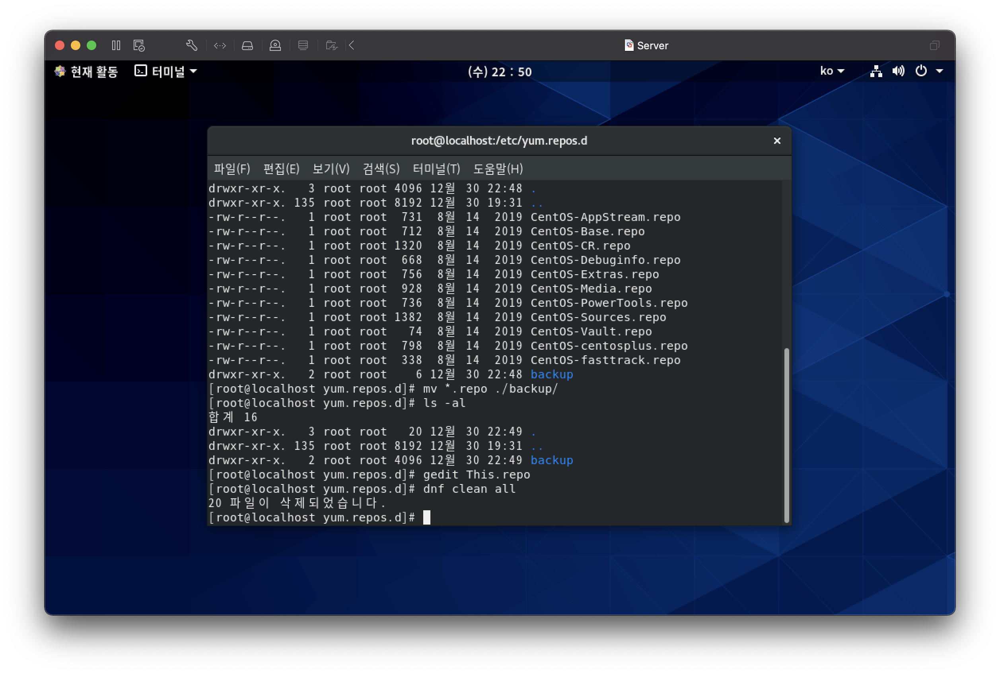

# ch.03-01 CentOS8 리눅스설치-Server

## 초기설정
1. OS update 제한
> gsettings set org.gnome.software download-updates false  
> systemctl disable dnf-makecache.service  
> systemctl disable dnf-makecache.timer  

2. Repo 수정
 

[31:23](https://youtu.be/bLlbCq2dRgk?list=PLVsNizTWUw7EJ9z-LW3lv3VC-6HI9I3hN&t=1883)

3. network 설정
* cd /etc/sysconfig/network-script

4. 보안 중지
* cd /etc/sysconfig/selinux

5. 한글설정

6. 방화벽설정
> dnf -y install firewall-config

7. gnome software 정지
